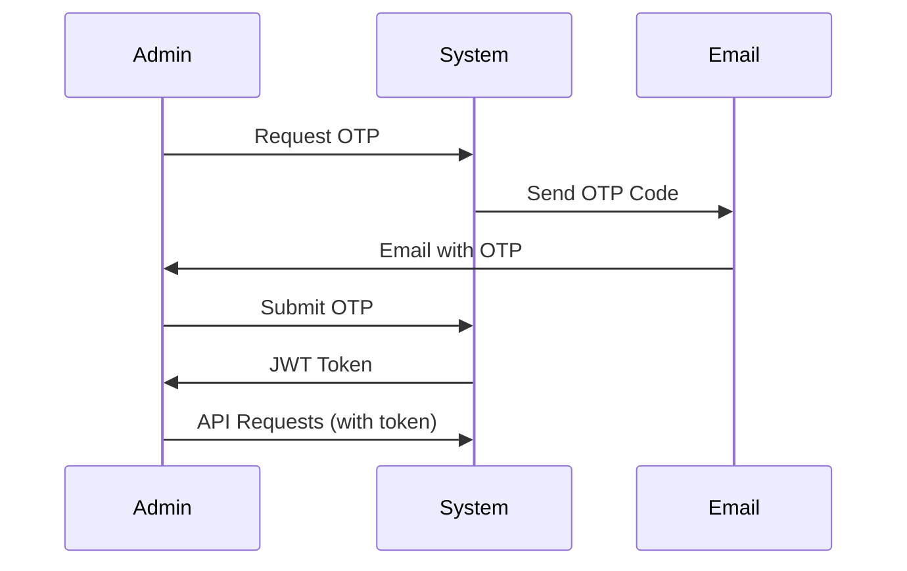

# 🚀 Portfolio Contact Backend

<div align="center">


**Secure, Production-Ready PHP Backend for Portfolio Contact Forms**

[🎯 Features](#-features) • [⚡ Quick Start](#-quick-start) • [🔧 API Documentation](#-api-documentation) • [🛡️ Security](#️-security)

</div>

---

## 🎯 Features

### 🔥 **Core Functionality**
- **📨 Contact Form API** - Secure endpoint for portfolio contact submissions
- **👤 Admin Dashboard** - Full-featured web interface for contact management  
- **🔐 OTP Authentication** - Email-based admin login with one-time passwords
- **📧 Email Integration** - SMTP notifications with PHPMailer
- **🛡️ Rate Limiting** - Anti-spam protection (5 requests/15 min per IP)
- **📊 Analytics** - Contact statistics and activity monitoring

### 🛠️ **Technical Features**
- **✅ Input Validation** - Comprehensive sanitization and validation
- **🔒 SQL Injection Protection** - Prepared statements and parameterized queries
- **🌐 CORS Ready** - Pre-configured for your domain
- **📝 Comprehensive Logging** - System activity and email delivery tracking
- **⚡ JWT Sessions** - Secure token-based authentication
- **🚦 Status Management** - Contact workflow (New → Read → Replied → Archived)

---

## ⚡ Quick Start

### 📋 **Prerequisites**
```bash
✅ PHP 8.0 or higher
✅ MySQL 5.7 or higher  
✅ Composer (PHP package manager)
✅ SMTP server access (Hostinger/Gmail/etc.)
```

### 🚀 **Installation**

1. **Clone/Download** your backend files to server
2. **Install Dependencies**
   ```bash
   composer install
   ```
3. **Configure Environment** - Update `.env` file:
   ```env
   # Database Configuration
   DB_HOST=localhost
   DB_DATABASE=your_database
   DB_USERNAME=your_username
   DB_PASSWORD=your_password
   
   # Email Configuration (Hostinger SMTP)
   SMTP_HOST=smtp.hostinger.com
   SMTP_EMAIL=no-reply@yourdomain.com
   SMTP_PASSWORD=your_email_password
   
   # Admin Configuration
   ADMIN_EMAIL=your-admin@gmail.com
   JWT_SECRET=your-secure-jwt-secret
   ```

4. **Initialize Database**
   ```bash
   php init-db.php
   ```

5. **Test Installation**
   ```bash
   php verify.php
   ```

### 🎉 **You're Ready!**
- **Contact Form**: `POST` to `contact.php`
- **Admin Panel**: Access `admin.html` in browser
- **API Testing**: Use included verification script

---

## 🔧 API Documentation

### 📨 **Contact Form Endpoint**

**`POST /contact.php`**

Send contact form submissions from your frontend.

#### Request Format:
```javascript
const formData = new FormData();
formData.append('name', 'John Doe');
formData.append('email', 'john@example.com');
formData.append('subject', 'Portfolio Inquiry');
formData.append('message', 'Hello, I am interested in your work...');

const response = await fetch('https://yourdomain.com/backend/contact.php', {
    method: 'POST',
    body: formData
});

const result = await response.json();
```

#### Response Format:
```json
{
    "success": true,
    "message": "Message sent successfully!",
    "contact_id": 123,
    "timestamp": "2025-07-30T10:30:00Z"
}
```

#### Error Responses:
```json
{
    "success": false,
    "message": "Rate limit exceeded. Please try again later.",
    "retry_after": 900
}
```

### 👤 **Admin Authentication**

**`POST /admin-auth.php`**

#### Step 1: Request OTP
```javascript
fetch('admin-auth.php', {
    method: 'POST',
    headers: { 'Content-Type': 'application/json' },
    body: JSON.stringify({
        action: 'request_otp',
        email: 'admin@example.com'
    })
});
```

#### Step 2: Verify OTP
```javascript
fetch('admin-auth.php', {
    method: 'POST',
    headers: { 'Content-Type': 'application/json' },
    body: JSON.stringify({
        action: 'verify_otp',
        email: 'admin@example.com',
        otp: '123456'
    })
});
```

### 📊 **Admin Dashboard API**

**Endpoints:**
- `GET /admin-dashboard.php?action=stats` - Contact statistics
- `GET /admin-dashboard.php?action=contacts` - List contacts (with pagination)
- `GET /admin-dashboard.php?action=contact&id=123` - Get specific contact
- `POST /admin-dashboard.php` - Update contact status
- `DELETE /admin-dashboard.php?action=contact&id=123` - Delete contact

---

## 🛡️ Security

### 🔒 **Security Features**

| Feature | Implementation | Status |
|---------|---------------|--------|
| **Rate Limiting** | 5 requests/15min per IP | ✅ Active |
| **Input Validation** | Comprehensive sanitization | ✅ Active |
| **SQL Injection Protection** | PDO prepared statements | ✅ Active |
| **XSS Prevention** | Output encoding | ✅ Active |
| **CSRF Protection** | Token validation | ✅ Active |
| **Authentication** | JWT + OTP verification | ✅ Active |
| **CORS Protection** | Domain whitelist | ✅ Active |
| **Email Security** | SMTP with authentication | ✅ Active |

### 🔐 **Authentication Flow**



### 📝 **Data Protection**

- **Sensitive Data**: Never logged or exposed
- **Passwords**: Hashed with secure algorithms  
- **Sessions**: JWT tokens with expiration
- **Database**: Parameterized queries only
- **Files**: `.gitignore` protects sensitive files

---

## 📁 File Structure

```
📁 backend/
├── 🔥 Core API
│   ├── contact.php              # Main contact form endpoint
│   ├── admin-auth.php           # OTP authentication system
│   └── admin-dashboard.php      # Admin panel API
│
├── 🎨 Admin Interface
│   └── admin.html               # Web-based admin dashboard
│
├── ⚙️ Configuration  
│   ├── .env                     # Environment variables (⚠️ sensitive)
│   ├── config.php               # Application configuration
│   └── database-schema.sql      # Database structure
│
├── 🔧 Core Components
│   ├── database.php             # PDO database operations
│   ├── security.php             # Authentication & rate limiting
│   └── email-service.php        # SMTP email handling
│  
├── 🛠️ Utilities
│   ├── init-db.php              # Database initialization
│   ├── maintenance.php          # Maintenance mode toggle
│   └── verify.php               # System verification
│
└── 📦 Dependencies
    ├── composer.json            # PHP dependencies
    └── vendor/                  # PHPMailer & other packages
```

---

## 🚀 Deployment Guide

### 📤 **What to Upload to Production Server**

✅ **REQUIRED FILES:**
```bash
📁 Essential Files
├── contact.php                  # Main API endpoint
├── admin-auth.php               # Authentication
├── admin-dashboard.php          # Admin API  
├── admin.html                   # Admin interface
├── config.php                   # Configuration
├── database.php                 # Database operations
├── security.php                 # Security functions
├── email-service.php            # Email handling
├── init-db.php                  # Database setup
├── maintenance.php              # Maintenance mode
├── verify.php                   # System verification
├── database-schema.sql          # Database structure
├── .env                         # Environment variables
├── composer.json                # Dependencies list
└── .gitignore                   # Git security
```

❌ **DO NOT UPLOAD:**
```bash
📁 Exclude These
├── backup-*/                    # Development backups
├── vendor/                      # Will be installed on server  
├── composer.lock                # Platform-specific
├── *.sh                         # Shell scripts (local use only)
├── PRODUCTION-README.md         # Development documentation
└── test files                   # Already removed
```

### 🔧 **Production Deployment Steps**

1. **Upload Core Files** (see required list above)
2. **Install Dependencies on Server:**
   ```bash
   composer install --no-dev --optimize-autoloader
   ```
3. **Set File Permissions:**
   ```bash
   chmod 644 *.php *.html *.json *.sql
   chmod 600 .env
   chmod 755 ./
   ```
4. **Initialize Database:**
   ```bash
   php init-db.php
   ```
5. **Verify Installation:**
   ```bash
   php verify.php
   ```

---

## 📞 Support & Documentation

- **Main Documentation**: This README.md (for developers)
- **Quick Reference**: All endpoints and examples included
- **Security**: Production-ready with comprehensive protection
- **Performance**: Optimized for high-traffic portfolio sites

---

<div align="center">

**🎉 Your Portfolio Backend is Production-Ready! 🎉**

Made with ❤️ for Genesis Software Portfolio

</div>